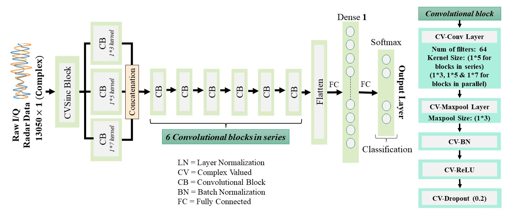
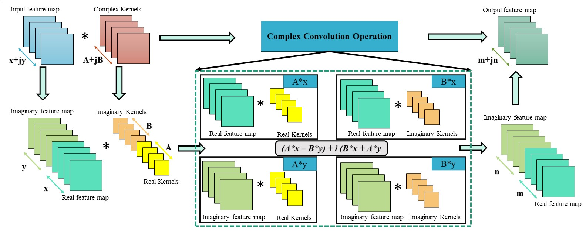
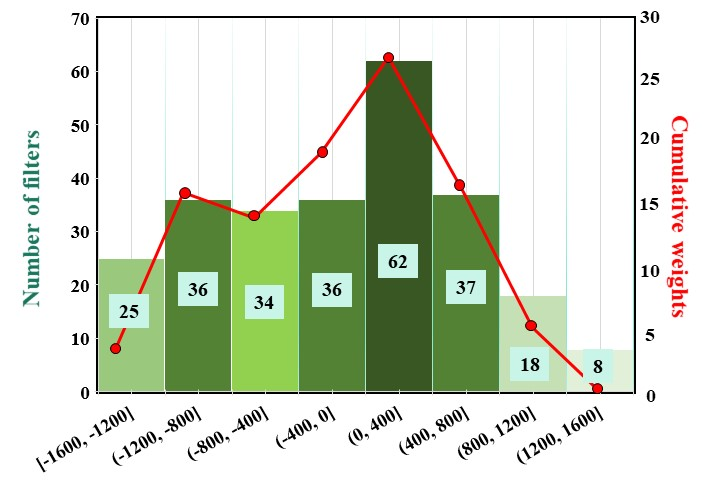
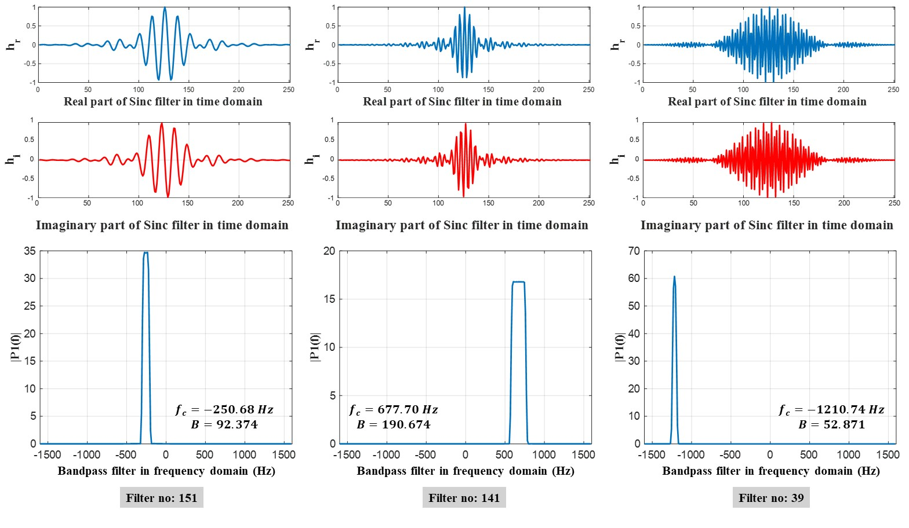
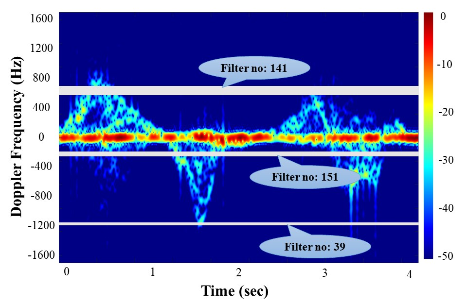
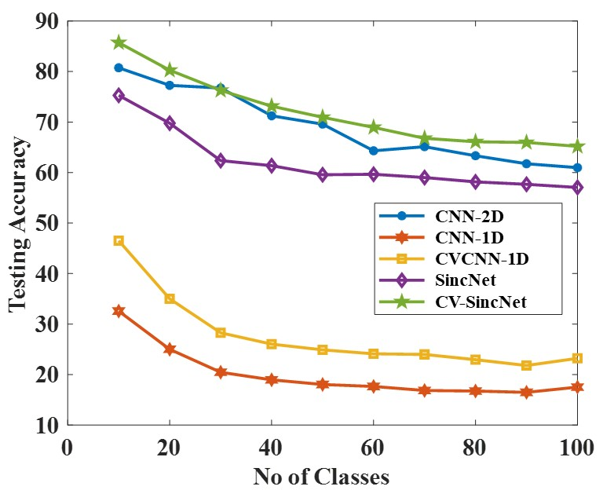
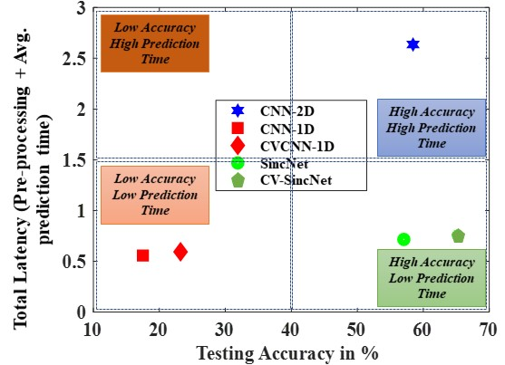

# Complex-Valued SincNet (CV-SincNet)

## Abstract
We propose a complex-valued neural network for real-time human motion recognition from raw radar data. Instead of relying on computationally expensive representations (range-Doppler, micro-Doppler, etc.), we learn directly from complex raw signals via complex sinc filters. These windowed band-pass filters automatically learn center frequencies and bandwidths in the initial layer. On a dataset of 100 American Sign Language (ASL) words, our approach improves accuracy by ~40% compared to a standard 1D CNN on raw RF data and ~8% compared to a real-valued SincNet. It also outperforms a 2D CNN on micro-Doppler spectrograms by ~4% while reducing overall latency by 71%.

---

## Setup
1. **Create a Conda environment from the `.yml` file** in this repository:
   ```bash
   conda env create -f environment.yml
   ```
2. **Check the TensorFlow version** (we recommend TensorFlow 2.10). By default, conda may install the latest version:
   ```bash
   python -c "import tensorflow as tf; print(tf.__version__)"
   ```
3. **If TensorFlow is not 2.10**, install it explicitly:
   ```bash
   pip install tensorflow==2.10
   ```
   or
   ```bash
   conda install tensorflow=2.10
   ```

---

## Usage
- **Main training script**: `train_cvsincnet.py`
  - Modify it to point to your own dataset if needed.
  - The model expects input data shaped as: **(length, channels, 1)**
    - `length` = 1D timeseries length
    - `channels` = 2 (for real and imaginary parts)
- **Complex Valued Layers**: All custom complex-valued layers are stored in the `complex_valued_layers` folder.

1. Activate the environment:
   ```bash
   conda activate cv_sincnet_env
   ```
2. Run training:
   ```bash
   python train_cvsincnet.py
   ```

---

## Citation
If you find this work useful, please cite our paper:

@ARTICLE{CV-SincNet,
  author={Biswas, Sabyasachi and Ayna, Cemre Omer and Gurbuz, Sevgi Z. and Gurbuz, Ali C.},
  journal={IEEE Transactions on Radar Systems}, 
  title={CV-SincNet: Learning Complex Sinc Filters From Raw Radar Data for Computationally Efficient Human Motion Recognition}, 
  year={2023},
  volume={1},
  number={},
  pages={493-504},
  keywords={Band-pass filters;Radio frequency;Human activity recognition;Radar imaging;Assistive technologies;Sign language;Radar;RF sensing;FMCW;micro-Doppler signature;CV-SincNet;human activity recognition;ASL},
  doi={10.1109/TRS.2023.3310894}}

## Model Architecture



*Figure 1: The CV-sinc block used as the intitial layer of the architecture.*


*Figure 2: Flow diagram of the CV-SincNet architecture.*



*Figure 3: Complex convolution operation.*

## Interpretability of CV-SincNet



*Figure 4: Filter and weight distribution in frequency domain of the learned complex sinc filters.*



*Figure 5: Three most important Sinc filters based on weights.*



*Figure 6: Three most important filters on a μ-D spectrogram.*

## Results/Performance comparison

## Performance Comparison

| **Network**        | **Top-1 Acc** | **Top-3 Acc** | **Top-5 Acc** | **Precision** | **Recall** | **F1 Score** |
|--------------------|---------------|---------------|---------------|---------------|------------|-------------|
| CNN-2D (on μ-Ds)   | 60.97         | 81.01         | 87.76         | 65.47         | 60.65      | 59.50       |
| CNN-1D             | 17.51         | 30.38         | 38.40         | 18.56         | 17.55      | 16.36       |
| CVCNN-1D           | 23.21         | 35.44         | 41.98         | 21.73         | 23.20      | 21.61       |
| SincNet            | 57.05         | 75.69         | 82.69         | 62.96         | 57.35      | 56.73       |
| **CV-SincNet**     | **65.19**     | **81.86**     | **88.82**     | **73.29**     | **65.45**  | **64.95**   |

*Table: Performance of various models on ASL recognition using radar signals.*




*Figure 7: Testing accuracy for all networks with respect to varying number of classes.*



*Figure 8: Testing accuracy vs prediction time for different architectures.*


